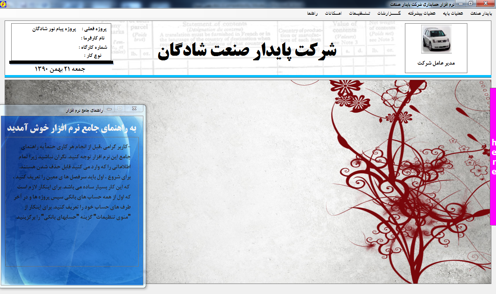

## وَكَانَ فَضْلُ اللَّهِ عَلَيْكَ عَظِيمًا - 113 سورة النساء

# Cactus (PS), with documentation

An Accounting software for comercial and academic purposes.

## Description

The app has following specifications:
- Handles complex Accounting operations
- Great UI/UX design
- Tested in every phrase
- Include comprehensive documentation

## Getting Started

## Tech Stack

## wireframes

## Demo

### Live Demo

No live demo

### Demo photos

## Styles and Design system

Windows Forms Thechnology

### Installing Dependencies

### Build & Run

#### Tests

- Unit/Integration Test

## Help

In case of any issues please reach out to me at: info@khaledr.ir

## Authors

[Khaled Rakhisi](https://www.linkedin.com/in/khaledrakhisi/)

## License

This project is licensed under the [Khaled Rakhisi] License - see the LICENSE.md file for details

## Acknowledgments

Inspiration, code snippets, etc.

- [awesome-readme](https://github.com/matiassingers/awesome-readme)
- [PurpleBooth](https://gist.github.com/PurpleBooth/109311bb0361f32d87a2)
- [dbader](https://github.com/dbader/readme-template)
- [zenorocha](https://gist.github.com/zenorocha/4526327)
- [fvcproductions](https://gist.github.com/fvcproductions/1bfc2d4aecb01a834b46)
